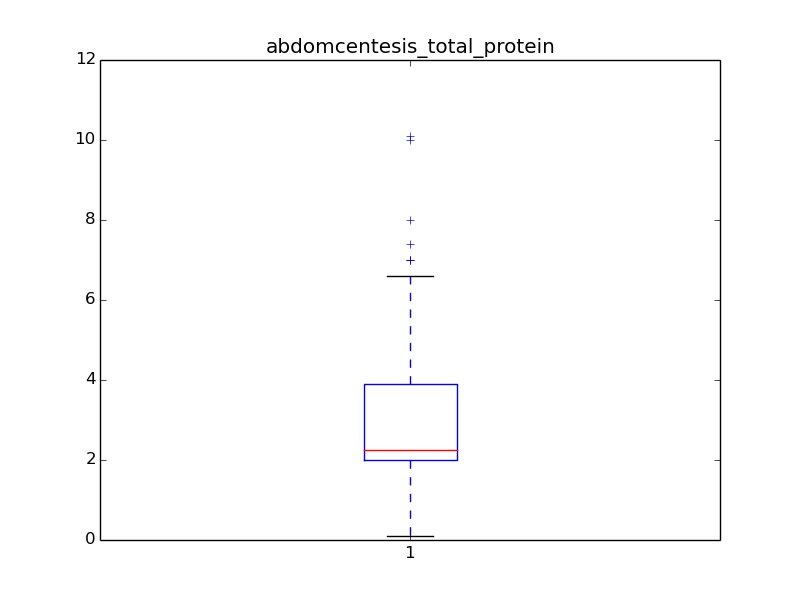
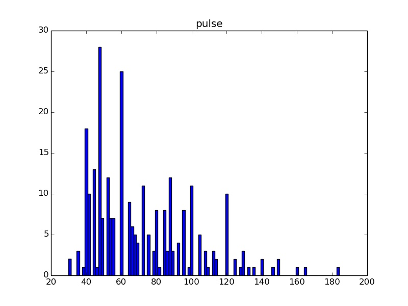

# DataMining-horse-colic
# Horse Colic Analysis Report

In this project, we use four different methods to solve the problem of how to process missing data.

    attr_info           #save each attribution information, including attribution name and it is 'nominal' or 'numeric'
    horse_colic_list    #save each sample
    arre_list           #save each attribution

    max_frequency_attr_list #attribution list in method 2
    max_frequency_list		#sample list in method 2
    hotdeck_attr_list 		#attribution list in method 3
    hotdeck_list			#sample list in method 3
    k_means_attr_list		#attribution list in method 4
    k_means_list			#sample list in method 4

    K_of_k_means            #define the K number in method 4

    data_preprocessing()    #preprocessing
    data_abstract()         #count data information (frequence, number of missing data, max, min, mean, median and so on)

#### Method 1: Erase missing data

we don't need to replace the missing data with other data, so just pass in function "data_preprocessing".

ATTRIBUTION  0: surgery

-------------nominal---------------

1: 180

2: 119

ATTRIBUTION  1: age

-------------nominal---------------

1: 276

9: 24

ATTRIBUTION  2: hospital_number

-------------nominal---------------

528977: 1

528298: 1

535176: 1

5279822: 2

530276: 1

528742: 1

529960: 1

528503: 1

534963: 1

528299: 1

5290759: 1

534403: 1

533902: 1

528151: 2

528872: 1

527698: 1

529840: 1

528183: 1

535043: 1

5297159: 1

527524: 1

530170: 1

5277409: 1

529849: 1

529518: 1

530526: 2

528682: 1

527916: 2

534478: 1

535364: 1

534885: 1

5294539: 1

534579: 1

5299253: 1

528668: 1

534572: 1

534163: 1

527758: 1

528248: 1

530366: 1

528743: 1

529135: 1

528904: 2

530360: 1

534491: 1

523190: 1

5292929: 1

530242: 1

534324: 1

528590: 1

533793: 1

530612: 1

528570: 1

530693: 2

533696: 1

5305129: 1

527463: 1

527518: 1

528214: 1

530002: 1

534817: 1

530001: 1

528355: 1

528461: 1

533983: 1

534719: 1

527677: 1

529428: 1

528469: 2

529427: 1

529424: 2

534092: 1

534899: 1

5279441: 1

5279442: 1

528630: 1

535314: 1

530310: 1

529483: 1

529642: 1

529640: 1

535158: 1

528638: 1

534933: 1

530251: 1

528031: 1

533928: 1

5283431: 1

530255: 1

530254: 1

5262541: 1

534784: 1

5262543: 1

533847: 1

534788: 1

529703: 1

530157: 1

529821: 1

529827: 1

528996: 2

534626: 1

5275212: 1

534624: 1

534157: 1

5288249: 1

5281091: 1

529340: 1

534556: 1

535415: 1

530301: 1

534644: 1

534135: 1

529498: 1

534618: 1

529493: 1

528620: 1

529296: 1

5291409: 1

5290409: 1

533836: 1

528548: 1

529893: 1

521399: 1

529528: 1

5290481: 1

534938: 1

526802: 1

530381: 1

529628: 1

530384: 1

5289419: 1

534004: 1

530478: 1

529183: 1

534145: 1

528134: 1

527709: 1

534833: 1

528729: 2

535407: 1

535392: 1

5278331: 1

529729: 1

529663: 1

529888: 1

529667: 1

530334: 1

528653: 1

528931: 2

535085: 1

527883: 1

535137: 1

535330: 1

530561: 1

529386: 1

533942: 1

527365: 1

530034: 1

529399: 1

527957: 1

530233: 1

534073: 1

533738: 1

528523: 1

528305: 1

534925: 1

530028: 1

529796: 2

530402: 1

532110: 1

530401: 1

526639: 1

535240: 1

535246: 1

529126: 1

528047: 1

5292489: 1

527563: 1

529777: 1

530319: 1

534115: 1

528641: 1

5294369: 1

534053: 1

535381: 1

529812: 1

5299603: 1

534857: 1

529388: 1

534183: 1

527940: 1

529865: 1

535338: 1

527829: 1

529461: 2

534597: 1

532349: 2

5290482: 1

534280: 1

534917: 1

534756: 1

533697: 1

533692: 1

534753: 1

5291719: 1

534998: 1

535031: 1

534615: 1

527702: 1

528019: 1

528702: 1

527706: 1

529764: 1

529766: 1

5297379: 1

534787: 1

528179: 1

528178: 1

529607: 1

528812: 1

530670: 1

5287179: 1

530239: 1

528890: 2

533750: 1

530624: 1

533968: 1

530354: 1

530544: 1

527734: 1

527544: 2

530051: 1

534519: 1

5287279: 1

534293: 1

530294: 1

527933: 1

535029: 1

532985: 1

529304: 1

528006: 1

529172: 1

528169: 1

533723: 1

528247: 1

521681: 1

534197: 1

535166: 1

518476: 1

535163: 1

535208: 1

529736: 1

528800: 1

5305629: 1

529045: 1

528804: 1

530101: 1

5299629: 1

530431: 1

533871: 1

529475: 1

5282839: 1

528964: 1

535130: 1

530439: 1

530438: 1

530297: 1

527929: 1

535054: 1

529685: 1

527927: 1

535196: 1

533886: 1

522979: 1

529373: 1

5291329: 1

529160: 1

5301219: 1

529272: 1

535292: 1

533887: 1

534069: 1

533885: 1

533736: 1

ATTRIBUTION  3: rectal_temperature

-------------numeric---------------

missing data: 60

max: 40.8

min: 35.4

mean: 38.1679166667

median: 38.2

1/4 point: 37.8

3/4 point: 38.5

ATTRIBUTION  4: pulse

-------------numeric---------------

missing data: 24

max: 184.0

min: 30.0

mean: 71.9130434783

median: 64.0

1/4 point: 48.0

3/4 point: 88.0

ATTRIBUTION  5: respiratory_rate

-------------numeric---------------

missing data: 58

max: 96.0

min: 8.0

mean: 30.4173553719

median: 24.5

1/4 point: 18.5

3/4 point: 36.0

ATTRIBUTION  6: temperature_of_extremities

-------------nominal---------------

1: 78

3: 109

2: 30

4: 27

ATTRIBUTION  7: peripheral_pulse

-------------nominal---------------

1: 115

3: 103

2: 5

4: 8

ATTRIBUTION  8: mucous_membranes

-------------nominal---------------

1: 79

3: 58

2: 30

5: 25

4: 41

6: 20

ATTRIBUTION  9: capillary_refill_time

-------------nominal---------------

1: 188

3: 2

2: 78

ATTRIBUTION  10: pain

-------------nominal---------------

1: 38

3: 67

2: 59

5: 42

4: 39

ATTRIBUTION  11: peristalsis

-------------nominal---------------

1: 39

3: 128

2: 16

4: 73

ATTRIBUTION  12: abdominal_distension

-------------nominal---------------

1: 76

3: 65

2: 65

4: 38

ATTRIBUTION  13: nasogastric_tube

-------------nominal---------------

1: 71

3: 23

2: 102

ATTRIBUTION  14: nasogastric_reflux

-------------nominal---------------

1: 120

3: 39

2: 35

ATTRIBUTION  15: nasogastric_reflux_PH

-------------numeric---------------

missing data: 247

max: 7.5

min: 1.0

mean: 4.70754716981

median: 5.0

1/4 point: 3.0

3/4 point: 6.5

ATTRIBUTION  16: rectal_examination

-------------nominal---------------

1: 57

3: 49

2: 13

4: 79

ATTRIBUTION  17: abdomen

-------------nominal---------------

1: 28

3: 13

2: 19

5: 79

4: 43

ATTRIBUTION  18: packed_cell_volume

-------------numeric---------------

missing data: 29

max: 75.0

min: 23.0

mean: 46.295202952

median: 45.0

1/4 point: 38.0

3/4 point: 52.0

ATTRIBUTION  19: total_protein

-------------numeric---------------

missing data: 33

max: 89.0

min: 3.3

mean: 24.456928839

median: 7.5

1/4 point: 6.5

3/4 point: 57.0

ATTRIBUTION  20: abdominocentesis_appearance

-------------nominal---------------

1: 41

3: 46

2: 48

ATTRIBUTION  21: abdomcentesis_total_protein

-------------numeric---------------

missing data: 198

max: 10.1

min: 0.1

mean: 3.01960784314

median: 2.25

1/4 point: 2.0

3/4 point: 3.9

ATTRIBUTION  22: outcome

-------------nominal---------------

1: 178

3: 44

2: 77

ATTRIBUTION  23: surgical_lesion

-------------nominal---------------

1: 191

2: 109

ATTRIBUTION  24: type_of_lesion_1

-------------nominal---------------

03400: 1

05205: 1

05206: 2

03133: 1

05124: 2

31110: 7

41110: 1

09000: 1

03207: 1

03205: 29

02124: 9

05400: 4

11300: 1

03115: 1

03112: 3

03113: 1

03111: 33

04111: 1

11400: 1

06112: 2

06111: 2

07400: 1

04300: 4

02300: 1

05111: 2

03209: 4

04122: 1

01124: 1

07113: 1

21110: 1

07111: 7

08300: 1

08400: 2

04207: 1

04206: 1

04205: 11

03300: 1

02322: 2

00400: 5

07209: 3

11124: 2

02207: 3

02206: 4

02209: 11

02208: 20

03025: 2

02305: 1

04124: 3

03124: 2

01111: 1

09400: 2

02111: 3

02113: 6

02112: 5

06209: 1

00300: 1

05000: 1

12208: 1

00000: 56

02205: 13

01400: 8

ATTRIBUTION  25: type_of_lesion_2

-------------nominal---------------

07111: 1

01400: 1

00000: 293

03111: 3

03112: 1

06112: 1

ATTRIBUTION  26: type_of_lesion_3

-------------nominal---------------

02209: 1

00000: 298

000000: 1

ATTRIBUTION  27: cp_data_list

-------------nominal---------------

1: 99

2: 201

| | |   |
| ------------- |:-------------:| -----:|
| |  |  |

| | |   |
| ------------- |:-------------:| -----:|
| |  |  |

#### Method 2: Replace missing data with Max frequency data

    erase_attr_set = set(erase_attr_list)
    for item in erase_attr_set:
	   frequency = erase_attr_list.count(item)
	   if frequency > max_frequency:
            max_frequency = frequency
            attr_replace = item

we process data based on attr_list. For each attribution list, first erase missing data and then count the frequency of each value. At last, choose the value with max frequency to replace the missing ones.

| | |   |
| ------------- |:-------------:| -----:|
| |  |  |

| | |   |
| ------------- |:-------------:| -----:|
| |  |  |

#### Method 3: Considering the correlation between attributions

The most important part in this method is correlation coefficient matrix. For an attribution, we need to calculate the correlation coefficient with other attributions. Then we select the most relative attribution (not missing) as a criterion to find the replaceable sample. At last, replace the missing data with the same attribution data of replaceable sample.

| | |   |
| ------------- |:-------------:| -----:|
| |  |  |

| | |   |
| ------------- |:-------------:| -----:|
| |  |  |

#### Mtehod 4: Considering the similarity of samples

In this method, we use the k-means algorithm. It is simple.

| | |   |
| ------------- |:-------------:| -----:|
| |  |  |

| | |   |
| ------------- |:-------------:| -----:|
| |  |  |
